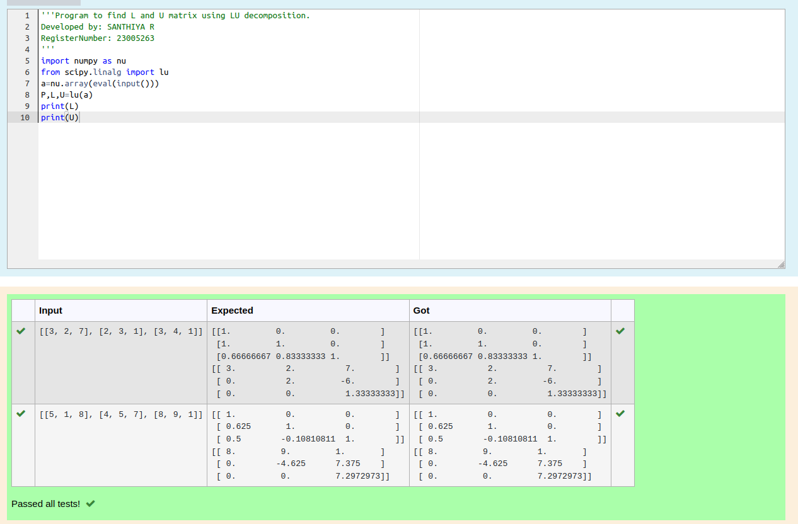
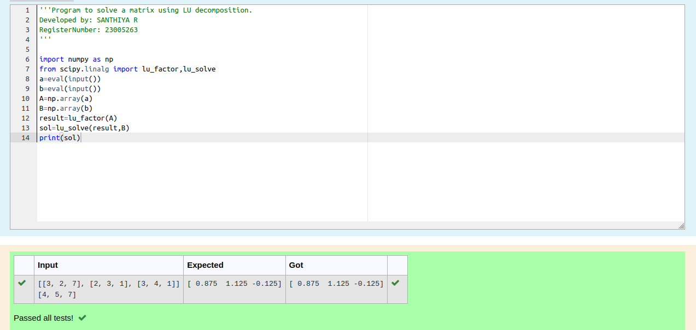

# LU Decomposition 

## AIM:
To write a program to find the LU Decomposition of a matrix.

## Equipments Required:
1. Hardware – PCs
2. Anaconda – Python 3.7 Installation / Moodle-Code Runner

## Algorithm
1. Start the Program 
2. Write the code appropriately 
3. Check the Code
4. Run the Program

## Program:
(i) To find the L and U matrix
```
Program to find the L and U matrix.
Developed by: SANTHIYA R
RegisterNumber: 23005263
import numpy as nu
from scipy.linalg import lu
a=nu.array(eval(input()))
P,L,U=lu(a)
print(L)
print(U)
```
(ii) To find the LU Decomposition of a matrix
```
Program to find the LU Decomposition of a matrix.
Developed by: SANTHIYA R
RegisterNumber: 23005263
import numpy as np
from scipy.linalg import lu_factor,lu_solve
a=eval(input())
b=eval(input())
A=np.array(a)
B=np.array(b)
result=lu_factor(A)
sol=lu_solve(result,B)
print(sol)

```

## Output:



## Result:
Thus the program to find the LU Decomposition of a matrix is written and verified using python programming.

